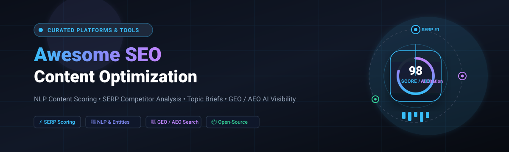

  

# 🚀 Awesome SEO Content Optimization 📈

### 🏆 Top SEO Content Optimization Platforms & Open-Source Tools Ecosystem
**A Curated Index of High-Performance SaaS Platforms & Self-Hosted Open-Source GitHub Repositories**  
*Mastering NLP Content Scoring, SERP-Based Optimization, Topic Coverage, Content Briefs, On-Page SEO, GEO/AEO & Generative Engine Visibility*

📅 **Last updated:** September 2026

---

## 📖 Overview & Executive Summary

This repository tracks notable **SaaS platforms** and **open-source projects** designed for **SEO Content Optimization**, **Generative Engine Optimization (GEO)**, and **Answer Engine Optimization (AEO)**. These state-of-the-art tools analyze top-ranking SERP competitors, score content drafts against live algorithms, extract high-salience entities, uncover semantic keyword gaps, craft automated content briefs, and empower content creators and SEOs to rank in both traditional engines (Google, Bing) and AI generative search engines (ChatGPT, Perplexity, Gemini, Claude, and Google AI Overviews).

💡 **Market Highlights:**
- **Category Leaders (Commercial SaaS):** Clearscope, Surfer SEO, MarketMuse, Frase, NeuronWriter, Dashword, WriterZen, Scalenut, Outranking, and SE Ranking Content.
- **Open-Source Vanguard:** Self-hostable, transparent engines and agentic workspaces such as **OpenSEO**, **SEOMachine**, **Towfiqi SerpBear**, **LibreCrawl**, **SEONaut**, **eGEOagents**, and **content-optimizer**.

---

## 📑 Table of Contents
- [📊 Market Landscape: Scale, Fragmentation & Trends](#-market-landscape-scale-fragmentation--trends)
- [🏢 SaaS/Hosted Platforms](#-saashosted-platforms)
- [💻 Open-Source GitHub Projects](#-open-source-github-projects)
- [🛠️ Frameworks for Building Custom SEO Engines](#-frameworks-for-building-custom-seo-engines)
- [🤝 How to Contribute](#-how-to-contribute)
- [⭐ Star History](#-star-history)
- [⚠️ Disclaimer](#-disclaimer)

---

## 📊 Market Landscape: Scale, Fragmentation & Trends

> 💡 **Market Size & Sector Structure:**  
> The global SEO software and AI content optimization sector is estimated at **~$85B–$108B in 2025–2026** (projected to reach **$200B+ by 2035** at a 13–18% CAGR). The market is **moderately fragmented** rather than a winner-take-all monopoly—consisting of high-growth suites (like SE Ranking and Surfer) coexisting alongside focused niche leaders (Clearscope for editorial grading, NeuronWriter for SMBs, Frase for briefs) and a rapidly expanding ecosystem of self-hosted open-source agents and GEO engines.

---

## 🏢 SaaS/Hosted Platforms

| Product | Company Size (Est. ARR / Valuation) | Description | Starting Pricing | Free Tier Limits |
| :--- | :--- | :--- | :--- | :--- |
| **[SE Ranking Content](https://seranking.com/)** | ~$35M ARR | Content optimization module within the broader SE Ranking SEO platform, offering scoring and on-page recommendations alongside rank tracking and audits. | Starts at $129/mo (Core plan; $103.20/mo billed annually) | 14-day free trial (10 projects, 750 tracked keywords/day, 20 AI prompts/day, 3 domains in AI research, no credit card required); no forever-free tier. |
| **[Surfer SEO](https://surferseo.com/)** | ~$15M–$16M ARR (Acquired by Positive Group; prev. ~$48M val.) | Leading real-time Content Editor that scores drafts against SERP competitors with NLP recommendations, AI writing support, and broad workflow integrations. | Starts at $59/mo (Discovery plan; $49/mo billed annually) or $95/mo (AI Search Analytics; $82/mo billed annually) | 7-day money-back guarantee on all plans (with active satisfaction support extension up to 30 days upon completing academy modules); no forever-free tier. |
| **[Scalenut](https://www.scalenut.com/)** | ~$10.3M ARR (~$3.5M funding raised) | AI-powered content platform combining research, optimization scoring, and long-form writing assistance at accessible price points. | Starts at $59/mo (Starter plan; often discounted to ~$24–$39/mo billed annually) | 7-day free trial with full platform access (up to 5–10 articles and AI visibility tracking; requires card); no forever-free tier. |
| **[MarketMuse](https://www.marketmuse.com/)** | ~$8.9M ARR (Last disclosed val. ~$6.5M) | Topic authority and content strategy platform focused on inventory analysis, topic clusters, content audits, and large-scale planning beyond single-page scoring. | Free forever tier available; paid plans start at $99/mo (Optimize plan; custom quote via demo) | Free forever plan: 10 queries/month, 1 user seat, Topic Navigator access (no tracked topics or briefs, no credit card required). |
| **[Frase](https://www.frase.io/)** | ~$1.8M ARR | Affordable all-in-one for AI-generated content briefs, SERP research, optimization scoring, and dual SEO/GEO visibility tracking. | Starts at $49/mo (Starter plan, or $39/mo billed annually) | 7-day free trial (full platform access including brief generation and optimizer, no credit card required); no forever-free tier. |
| **[Clearscope](https://www.clearscope.io/)** | ~$1.5M ARR | Premium content optimization platform known for clean A–F grading, rigorous term scoring, and editorial-friendly feedback for human-written drafts. | Starts at $129/mo (Essentials plan, or $1,428/yr paid annually) | No free tier or trial; demo available upon request with a case-by-case refund policy. |
| **[WriterZen](https://writerzen.net/)** | ~$660K ARR | Keyword research and content optimization suite with clustering, brief generation, and on-page guidance. | Starts at $23/mo (Lite plan; or $75 one-time lifetime license) | 15-day free trial with full feature access (Keyword Explorer, Topic Discovery, Content Creator, no credit card required); no forever-free tier. |
| **[Outranking](https://www.outranking.io/)** | ~$440K ARR | Content optimization and AI writing tool focused on SERP analysis, outlines, and competitive content improvement. | Starts at $29/mo (Starter plan, or $20/mo billed annually) | 7-day money-back guarantee / limited trial with 1 article analysis; no forever-free tier. |
| **[NeuronWriter](https://neuronwriter.com/)** | Private / Bootstrapped (<$1M est. ARR; 300K+ users) | Budget-friendly NLP content optimizer with SERP-based scoring, entity analysis, and AI writing features popular with solo creators and small teams. | Starts at €23/mo (~$25/mo, Bronze plan, or €19/mo billed annually) | 7-day free trial with full Gold plan access (10 projects, 75 content analyses, no credit card required); no forever-free tier. |
| **[Dashword](https://dashword.com/)** | Private / Bootstrapped (Undisclosed ARR) | Content optimization and briefing tool aimed at teams that want structured recommendations and workflow support. | Starts at $99/mo (Startup plan, or $79/mo billed annually) | 1 free content report/brief evaluation upon sign-up (no credit card required; up to 2 extra credits on completing optimization tasks); no forever-free tier. |

## 💻 Open-Source GitHub Projects

Curated open-source engines, developer tools, and AI agent frameworks for self-hosted SEO content optimization, rank tracking, site auditing, and Generative Engine Optimization (GEO). Repositories are ranked in descending order by GitHub stargazers count:

- **[OpenSEO](https://github.com/every-app/open-seo)**   
  🌟 Comprehensive open-source alternative to Semrush and Ahrefs — keyword research, rank tracking, technical audits, and content workflow support powered by self-hosted architecture and DataForSEO integration.

- **[SEOMachine](https://github.com/TheCraigHewitt/seomachine)**   
  🤖 Specialized Claude Code agent workspace for researching, drafting, and optimizing long-form, rank-ready SEO content tailored to target audience intent.

- **[SerpBear](https://github.com/towfiqi/serpbear)**   
  🐻 Self-hosted search engine rank tracking application with built-in keyword discovery, SERP scraping, performance charts, and notification alerts.

- **[n8n SEO Templates](https://github.com/Marvomatic/n8n-templates)**   
  ⚡ Automated workflow pipelines for keyword research, content briefs, programmatic SEO publishing, and competitor tracking using n8n automation.

- **[LibreCrawl](https://github.com/PhialsBasement/LibreCrawl)**   
  🕷️ High-performance open-source technical SEO crawler and site auditor designed to diagnose on-page architecture, broken links, meta tags, and indexability issues.

- **[SEONaut](https://github.com/StJudeWasHere/seonaut)**   
  🧭 Open-source website crawler and SEO audit tool written in Go that scans sites to detect structural flaws, orphan pages, and content optimization issues.

- **[Public SEO Scripts](https://github.com/searchsolved/search-solved-public-seo)**   
  🐍 Battle-tested Python scripts and Streamlit apps for automated internal linking, keyword clustering, entity extraction, and content gap analysis.

- **[eGEOagents](https://github.com/mverab/eGEOagents)**   
  🧠 Cutting-edge open-source Generative Engine Optimization (GEO) and Answer Engine Optimization (AEO) toolkit — analyzes and refactors content for visibility in ChatGPT, Perplexity, Gemini, Claude, and Google AI Overviews.

- **[30x-SEO Skills](https://github.com/norahe0304-art/30x-seo)**   
  🎯 23+ production-ready AI agent skills for Claude Code covering technical on-page audits, keyword clustering, semantic entity optimization, and AI search visibility.

- **[seo_optimizer](https://github.com/cleven12/seo_optimizer)**   
  📊 CLI utility uniting traditional SEO checks with LLM recommendations (Gemini & OpenAI) for automated keyword matching and content readability improvement.

- **[seobot](https://github.com/George3307/seobot)**   
  🤖 Open-source AI SEO agent toolkit managing end-to-end keyword research, automated draft generation, and technical content audits.

- **[content-optimizer](https://github.com/sharozdawa/content-optimizer)**   
  🎯 Open-source alternative to Surfer SEO — SERP-based scoring across 7 critical dimensions (keywords, word count, headings, readability, entities, depth, and structure) with MCP & API support.

- **[seoagent](https://github.com/yagomp/seoagent)**   
  🛠️ Agent-first SEO toolkit equipped with keyword research, competitor gap analysis, technical site diagnostics, and automated AI strategy generation.

---

## 🛠️ Frameworks for Building Custom SEO Engines

Why choose between SaaS convenience and open-source flexibility when you can combine them? Modern engineering teams are assembling private, high-accuracy SEO optimization pipelines:

1. 📥 **SERP Data Ingestion:** Fetch raw top-10 search results using open scrapers or high-reliability SERP APIs.
2. 🧮 **Deterministic Content Scoring:** Leverage **[content-optimizer](https://github.com/sharozdawa/content-optimizer)** or spaCy-based entity extractors to grade draft copy across keyword frequency, semantic salience, and structure.
3. ✍️ **AI Brief & Draft Refinement:** Pass scoring feedback into local LLMs (Ollama, vLLM) or flagship commercial models (Claude 3.7 / GPT-4o / Gemini 2.5) using **[SEOMachine](https://github.com/TheCraigHewitt/seomachine)** or **[30x-SEO](https://github.com/norahe0304-art/30x-seo)**.
4. 🤖 **GEO / AEO Citability Optimization:** Apply **[eGEOagents](https://github.com/mverab/eGEOagents)** to ensure citations surface prominently across ChatGPT Search, Perplexity, and Google AI Overviews.
5. 📈 **Continuous Rank Tracking & Audits:** Monitor rankings self-hosted via **[SerpBear](https://github.com/towfiqi/serpbear)** and crawl sites with **[LibreCrawl](https://github.com/PhialsBasement/LibreCrawl)**.

---

## 🤝 How to Contribute

Contributions from the SEO and developer communities are warmly welcomed! 🌟

1. 🍴 Fork the repository.
2. 🌿 Create a new feature branch (`git checkout -b feature/new-seo-tool`).
3. 📝 Add or edit entries in `README.md` following the established format (Product name, official link, stargazers badge for open-source repos, 1–2 factual sentences, and pricing/stargazer data).
4. 🚀 Submit a Pull Request with a clear, concise description of your changes.

Don't forget to **⭐ star this repository** to keep up with the latest advancements in search and generative optimization!

---

##  Star History

---

## ⚠️ Disclaimer

- This is a **community-curated** list designed for research and educational purposes — listings do not constitute an explicit commercial endorsement.
- Content optimization tools provide probabilistic guidance based on current SERP patterns and linguistic models; they do not guarantee top organic search rankings. Over-optimization can degrade readability and user experience.
- All AI-generated or heavily scored copy should undergo rigorous human editorial review, fact-checking, and adherence to search engine quality rater guidelines.
- Self-hosted open-source software requires your own API/SERP credentials and operational infrastructure.

---

**Crafted with ❤️ for SEO professionals, growth marketers, content teams, and indie developers worldwide.**  
*Empowering data-driven search visibility and transparent content engineering.*

